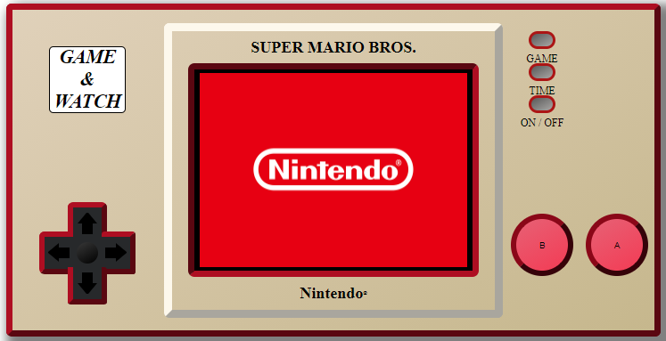

Primer proyecto: réplica de una consola con la funcionalidad de encendido.

He recreado la consola Game & Watch de Super Mario.

<h5>Estas han sido las tecnologías empleadas:</h5>
<ul>
    <li>HTML5</li>
    <li>CSS3</li>
    <li>JavaScript</li>
</ul>

<h5>Resultado del proyecto:</h5>

 
<h5>Funcionalidades:</h5>
Pulsa el botón ON/OFF "encender y apagar" la consola.
Pulsa el botón GAME para "cambiar" de juego.

